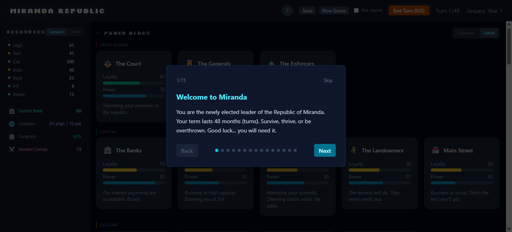

# Miranda Republic

A political simulation game set in a fictional developing nation. Navigate four years as president, balancing competing factions, managing an economy under pressure, and surviving the machinations of your political rival.

**[Play Now](https://arrudafranco.github.io/miranda-republic/)**



## About

Miranda Republic is a turn-based strategy game where every policy decision ripples through 14 political blocs, from the Banks to the Underworld. Manage your legitimacy, control the national narrative, and keep the Colossus (a powerful foreign superpower) from losing patience. With 51 policies (including 5 milestone-exclusive rewards), 9 achievement milestones, event outcome cards, dynamic events, crisis chains, an Inauguration Day narrative opening, richly varied turn briefings, narrative epilogues (Presidential Dispatches) for all 10 endings, and 10 possible endings, no two playthroughs are alike.

The desktop UI features switchable Overview/Detail modes for blocs, policies, milestones, and the sidebar, collapsible sections, dynamic resource bar coloring, a milestone tracker with condition checklists, an always-visible toolbar End Turn button with action count, close buttons on all informational modals, and a guided 14-step tutorial with spotlight highlighting. Fully responsive for mobile with a 5-tab layout.

## Tech Stack

- **Framework:** React 19
- **State Management:** Zustand 5
- **Styling:** Tailwind CSS v4
- **Build Tool:** Vite
- **Language:** TypeScript
- **Testing:** Vitest with seedable PRNG (130 unit tests across 7 suites, including 3,000-seed fuzz across 3 difficulty levels) + cross-browser smoke tests (Chromium, Firefox, WebKit)

## Local Development

```bash
git clone https://github.com/arrudafranco/miranda-republic.git
cd miranda-republic
npm install
npm run dev
```

The game runs at `http://localhost:5173/miranda-republic/` by default.

## Documentation

For a complete reference of all game mechanics, policies, events, crisis chains, endings, and design rationale, see **[DESIGN_DOCUMENT.md](DESIGN_DOCUMENT.md)**.

## Project Structure

```
src/
  components/   # React UI components
  data/         # Policy definitions, bloc data, events
  engine/       # Game logic (rival AI, economy, congress, narrative)
  hooks/        # Custom React hooks
  types/        # TypeScript type definitions
  utils/        # Seedable RNG, helpers
  test/         # Vitest engine tests (run with npm test)
```

## Testing

```bash
npm test              # 130 unit tests (engine logic, milestones, briefing, fuzz, balance)
npm run test:browsers # Cross-browser smoke tests (requires dev server running)
```

Cross-browser tests launch Chromium, Firefox, and WebKit via Playwright to verify that the game loads, renders core UI, and plays through the opening sequence without errors. Install browsers with `npx playwright install chromium firefox webkit`.

## How This Was Built

Miranda Republic was built collaboratively with [Claude Code](https://claude.ai/code) (Anthropic's AI coding tool). Here's what each side contributed:

**My role (Gustavo):** Game concept and setting, mechanical design (bloc interactions, rival system, crisis chains, difficulty tuning), UX decisions, balance priorities, and iterative review of every feature before it shipped. I directed the architecture through detailed implementation plans and caught issues Claude missed (accessibility gaps, nested tooltip bugs, writing style violations).

**Claude's role:** Implementation of the engine modules, React components, test harness, and build tooling. Claude translated design specs into working TypeScript, wrote the seedable PRNG testing infrastructure, and handled the mechanical details of state management, save migration, and CSS.

### Technical Details

- **Game engine architecture.** Pure-function engine with thirteen modules (rival AI, congressional math, narrative phase, crisis chains, policy unlocks, turn briefing, etc.) composing without side effects.
- **Deterministic testing with seedable PRNG.** All randomness routes through a seedable Mulberry32 PRNG. Vitest runs 3,000 fuzz simulations (500 seeds x 3 difficulties x 2 suites) asserting invariants across ~144,000 game ticks, with any failure producing a deterministic repro. Cross-browser smoke tests verify rendering in Chromium, Firefox, and WebKit.
- **Progressive disclosure UI.** 51 policies organized into 7 filterable categories with progressive unlocks (18 starting, 28 via conditions, 5 via milestone achievements). 9 achievement milestones with condition checklists and narrative reward cards. Event outcome cards provide narrative payoff for choices. Context-aware resource tooltips teach mechanics through play.
- **Complex system balancing.** 14 interacting blocs with sensitivity matrices, ripple effects, polarization feedback loops, and a multi-phase turn structure. Difficulty tiers tuned via parameterized configs, validated by automated balance assertions.
- **Accessibility.** ARIA roles and labels, semantic HTML, keyboard navigation with focus traps in modals, `prefers-reduced-motion` support, and high-contrast color choices.
- **Save/load with forward migration.** LocalStorage persistence with migration logic for schema evolution, ensuring older saves load cleanly as new mechanics are added.

## Feedback

Found a bug? Have an idea for a new policy, event, or ending? [Open an issue](https://github.com/arrudafranco/miranda-republic/issues) or submit a pull request. Miranda is an evolving republic, and community input makes it better.

## Credits

Created by Gustavo Arruda Franco, with Claude Code (Anthropic).
